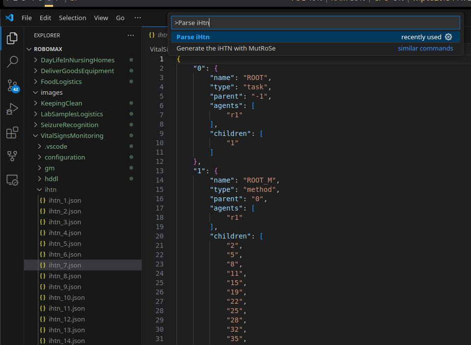

# Para criar IHTNs:

- Usar a extensão do VSCode do MutRoSe
    - Resultado será as IHTNs em json
    - Usando a command palette, selecionar "**Parse IHTNs**"

### Não vai funcionar com todas as missões
(Não consegui fazer a decomposição das missões com dois Goal Models)